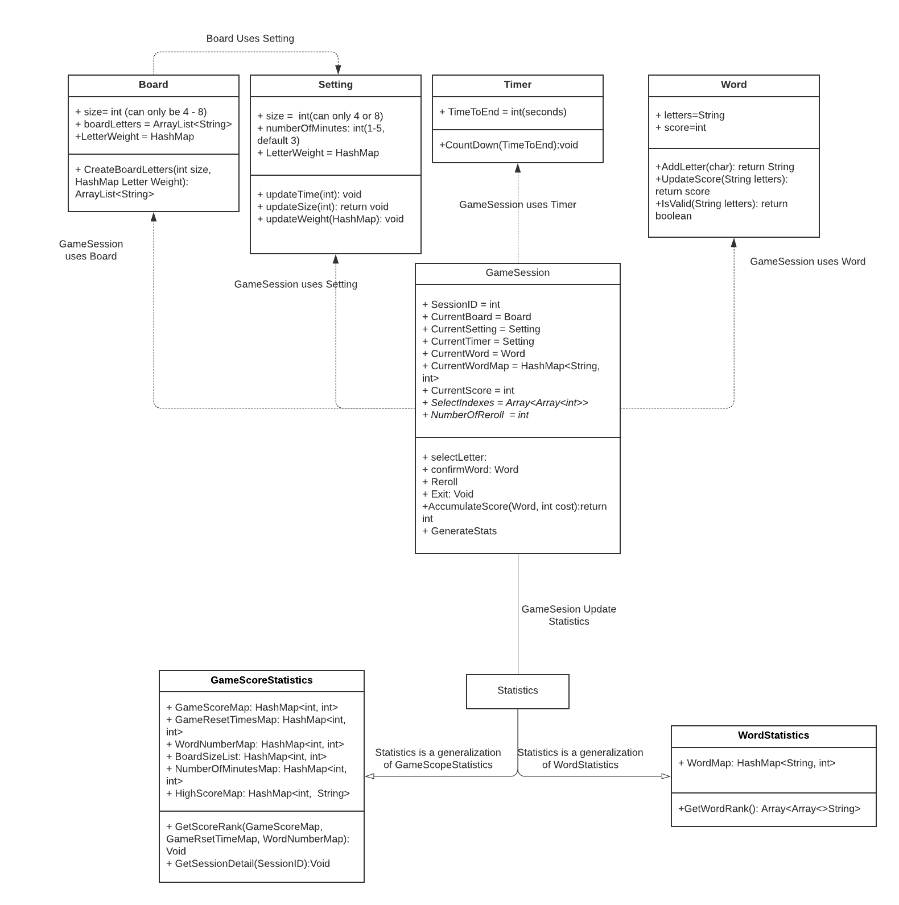
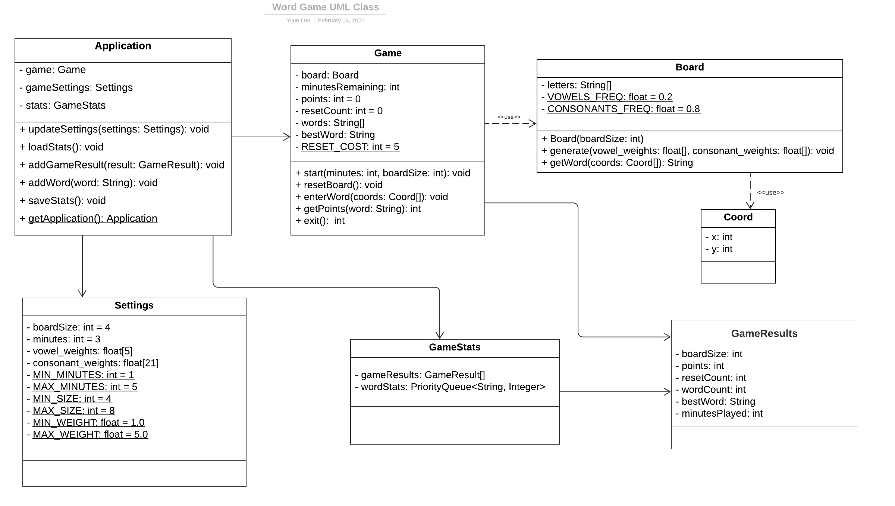
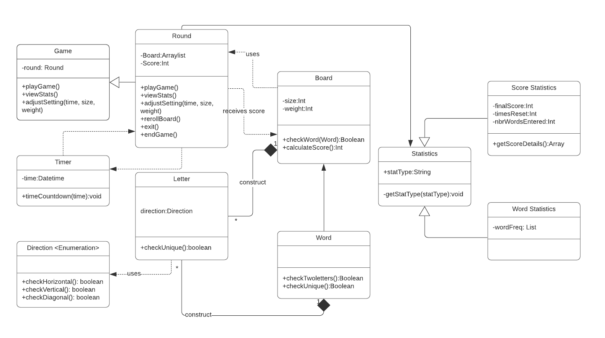
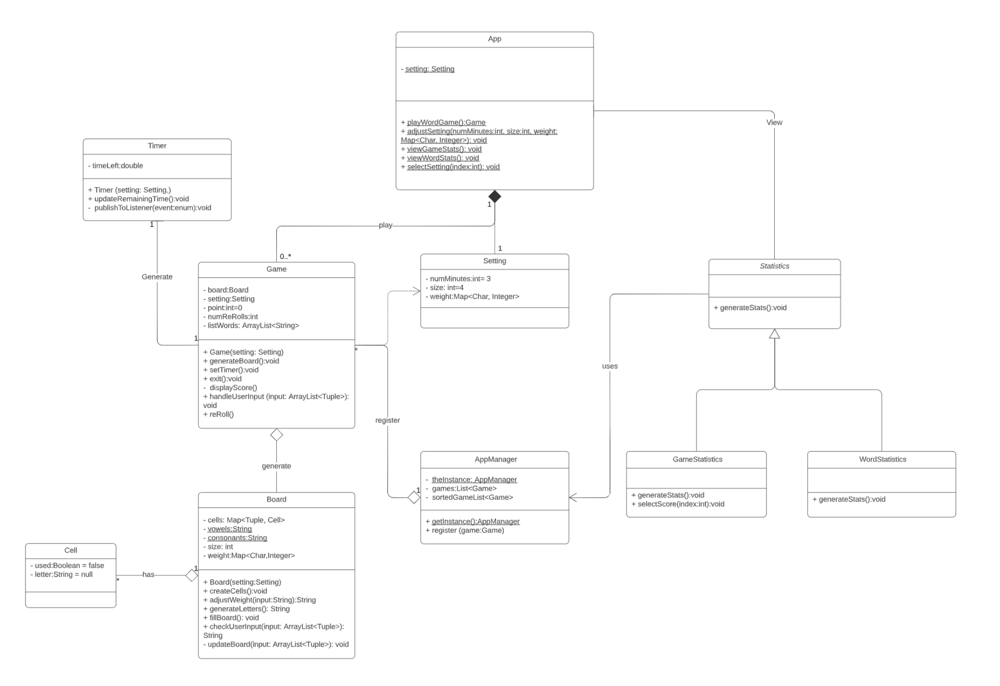
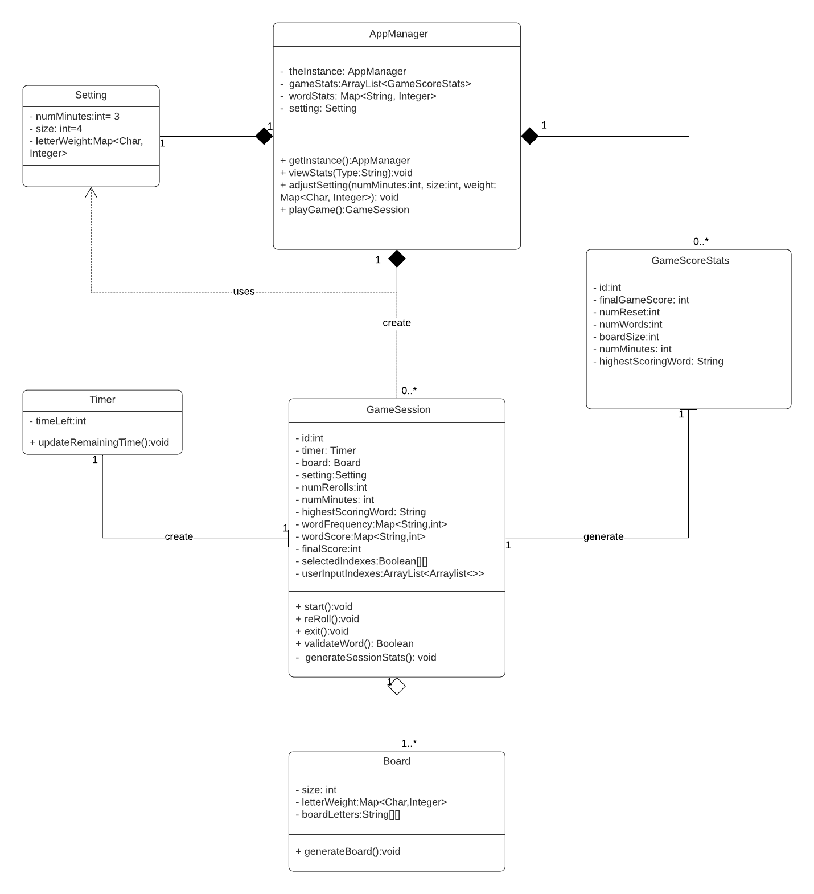

## Individual Designs
### Design 1

#### Pros:
- Seperating the timer, board, setting and word class. Coordinate all above class with the GameSession Class. Follow the single responsibility rule.
- Calculate and update the game score statistics and word statistics when the game session ends. Only the calculated game statistics are stored, saving the storage space and speed up the program when viewing statistics.
- A clear relationship between different kinds of classes. GameSession use the classes on the first row and update the statistic class. Both GameScoreStats and WordStats are subclass of the statistic class.
#### Cons:
- The attributes of GameScoreStats that is stored in seperated hashmap, making it hard to sort them together by a common key field.
- The confirmWord operation and the accumulateScore operation are overlapping with each other. The score will be update when the word is updated. There is no need to set a seperated operation.
- The word class assume the word score needs to be updated everytime a new letter is selectd, which may not be necessary.

### Design 2

#### Pros:
- This design follows single responsibility principle, each designed class such as Application class, Game class, Board class, Settings class, GameStats class, GameResults class and Coord class is responsible for only one thing. 
- The design also used a singleton class: the Application class. As there only will be one object of application, this class controls concurrent access to the game resource and the access to the resource will be requested from multiple parts of the system. 
- The design also introduces the class of Coord, it can be used by the Board class to get the coordination of user’s input so that it would be easy to map the coordination array to the word the user enters. 
- The design introduces the GameResults class, which is used to store the game score and other statistics of every game. This class will be used by the GameStats, which contains the statistics of the score of each game and the words statistics across all the game, makes the implementation more clear.

#### Cons:
- The data structure to store the gameResults and wordStats might need to be reconsidered. It might be better to use arrayList or map to store the gameResults, and map to store the word and their frequency across all the games.
- The getWord(coords) method in Board class might be better move to the Game class. So that the process of getting user’s input, validate the input and calculate the score of word entered can be completed in one class. 
- The exit() method in Game class might be better return nothing than the integer. As the getPoints(w) method in the same class has already has the function of calculating the scores and update the total scores. it would be better to just have the function of displaying the total score than actually return the score.
- Doesn’t have the Timer class, might need to add it.

### Design 3

#### Pros:
- The design follows the single responsibility rule, classes of statistics, game statistics, word statistics, letter, word, board, timer, round, game and direction are designed to fulfill the requirements and each class is designated to only one requirement.
- The design has two seperate classes, round and game, to take care the difference between game sessions and games, so that when statistics is calculated, it is easier to differentiate session level stats and game level stats.
- The design saves intermediate results like score, word for statistics class, so that when statistic class is called, no track-back computation could be avoided.
- The relationship among classes is clear, for example, the timer will receive time setting when each round is initiated, and the timer will watch round class to terminate the game round when time is up.

#### Cons:
- The statistic class is designed as generalization of game statistics class and word statistics class, which is kind of redundant, because the statistic class alone could hold all the attributes, and when displaying on the UI, the user's choice will decide which attributed to be shown.
- The direction class is unnecessary, because when encoding the letter into 2D index, the calculation of indices could check whether horizontal, vertical, and diagonal. 
- The word class is unnecessary because indices list could automatically generate "word" that the program could recognize.
- The datatype in Timer does not need to be datetime, because we only care about countdown of minutes (seconds), thus int should be enough to do the work.
- Should have a setting class to take care of user inputs and send to each relevant class.

### Design 4

#### Pros:
- Both GameStatistics and WordStatistics can substitute for Statistics since
  both classes implement Statistics interface. During runtime, based on the 
  type of user input in viewStats method (Word vs Game score), the type of subclass will be created,
  and will call the implemented generateStats method. This is similar to factory design pattern.
  
- Use AppManager singleton object to manage all game statistics
- Statistics interface is open for extension. If other types of stats are needed
  in the future, we can simply add a subclass implementing the Statistics interface

#### Cons:
- Too much UI specific elements are considered in the design, for example,
  event, activity, and listener shouldn't be factored into the design

- Some classes have multiple responsibilities which is against the single responsibilities
  principle. For example, Game class handles user input, generates board and displays score.
  display score and handle user input should be handled by client interface

- A result or stats class should be created to store all the needed stats for display. Instead of storing a list of Games object in AppManager, result or
  stats object should be stored. This way it will be easier for GameStatistics and WordStatistics
  to sort stats
  

  
## Team Design
### AppManager, Settings, Timers and Board class
Those classses are brought up in the individual designs, just in different names. The operations in those classes varies by different individuals, but after our discussion, we’ve all agreed on as follows:

### AppManager class:
We’ve decided to create the AppManager class to support the requirement 1. 
This singleton class will have the attributes like: the AppManager instance, the gameStats ArrayList to store the score and any other related settings statistics(as in the requirement 6) of each game session, the wordStats Map (as in requirement 7) to store each word and its corresponding times played across all the game and the settings of the each game session.
The operations in the class includes: 1. viewStats() will be sorting the ‘gameStats’ ArrayList and ‘wordStats’ hashMap before displaying the stats for the users. 2. adjustSetting(setting) will be parsing the new settings object if user changes the settings, 3. playGame() is to construct the GameSession object. 4, getInstance() is to get the object of AppManager so that other classes can access the resources of the AppManager.

### Settings class:
We’ve created the settings class to support requirement 2. We’ve added three variables ‘numMinutes’ and ‘size’ and ‘letterWeight’. The ‘numMinutes’ is to store the maximum minutes the user chooses to play, the ‘size’ stores the board size the user chooses; and we’ve decided to use hashMap to store the ‘letterWeight’, which maps the characters and their corresponding weight that the user prefers. 

### Timer class:
We’ve created the Timer class to countdown the time for each game session. The timer object will be used by the gameSession classThe ‘timeLeft’ variable is to store the time left, the function updateRemainingTime() is to run and stop the timer as needed.

### Board class:
We’ve decided to create the Board class which will be responsible for generating and resetting the board in each game session. We used int ‘size’ and hashMap ‘letterWeight’ to store the board size and each letter’s weight from user’s preference. We added the generateBoard() method to create the board of random generated characters. We used ‘boardLetters’ 2D arrays to store the character generated, and the indices represents the coordination of each characters. With the indices, it would be easier to get the word generated and validate the word in this way in the game session.

### GameSession class
The GameSession class is brought by multiple individual designs within our group (it may be called game class or round class in the design UML). We decide to call it GameSession to differentiate it from the whole game class(not limit to one session).

The attributes and operations are designed to satisfied a few major purpose: 
1. support elements that are necessary when players are playing: ID, Board, Setting attributes, and start/reroll/exit operations.

The Setting stores the basic board size, letter weight and number of minutes of the games. The board class will generate corresponding board according to the setting. The ID field will be used as a unique identifier of the game session. timer will count down time. It will end the game when timeLeft = 0.

2. support interaction elements that are essentical for a game session: userInputIndexes, selectedIndexes attributes, validateWord operations.

The userInputIndexes ArrayList<ArrayList<int>> will store the index position of word user inputs. The selectIndexes is a 2D boolean array that shows whether a letter has selected before. The validateWord operation will validate the current word input -- check if it has at least two letters, only includes adjacent letters and never uses duplicate indexes. If all these criterials are satisfied, highestScoringWord, wordFrequency, wordScore and finalScore will be updated.

3. support stats calcultion: numRerolls, numMinutes, highestScoringWord, wordFrequency, wordScore, finalScore attributes and generateStats operations.

numRerolls records the number of rerolls the game session. The numMinutes records the number of Minutes th e session has. The highestScoringWord stores the single word that has the highest score. WordFrequency is a hashmap storing the words and number of times it has been played. WordScore is a hashmap storing the words and corresponding scores. finalScore is a single int stores the final score of game session. All of these attributes will be either used to update the GameScoreStats or the wordStats hashmap in the App Manager. The generateStats operation will be called at the end of game and update all stats in the App manager.

The key improvement here is that the GameSession class reduce the redundant of the attributes and operation. Actions that can be done at the same time are combined. For example, validate word, adding letters and update score of the words are combined together within the validateWord operations. 

Another clear improvement is that we generate and aggregates the stats at the most convenient time. Word level stats is calculated when validate the word. Game level stats is generated when the game end. Appropriate data type is selected for different kinds of stats. For example, wordFrequency use hashmap to store the number of times each word has been played. It can be used to update the wordStats hashmap in the appManager in a convenient way when the game ends.

### GameScoreStats class:
To fulfill the requirement 6 and 7, the stats class was brought up in multiple designs, and we decide to put all the statistics attributes into one class, GameScoreStats, to store statistics on sesseion level. The attributes of the GameScoreStats are the following: id (int), finalGameScore (int), numReset (int), numWords (int), boardSize (int), numMinutes (int), and highestScoringWord (String).

Attribute id is the unique session identifier. Attribute finalGameScore is to display the total score of each session. Attribute numReset records the number of times the board was reset. Attribute numWords means the number of words entered in the game. When the user selects to view game score statistics, the finalGameScore, numReset, and numWords attributes are called, and the backend program will sort the stats by final game score in descending order before presenting on the GUI. 

Moreover, the user is able to select the game score to see more details related to that round. The user's score-selection action, would call attributes boardSize, numMinutes, and highestScoringWord, representing game’s board size, number of minutes, and the highest scoring word of that session. All the attributes in this class are pre-calcuated in the GameSession class, and whenever the users choose to review the game score statistics in the GUI, the AppManager will pull relevant attribtues from the finalGameScore class and construct them as an arraylist for viewing.

When the users chooses to view word statistics, since the wordsStats hashmap is updated after each game session, the AppManager will directly sort wordStats hashmap by frequency descendingly, and present on the GUI.

## Summary
### Design: 
- There may be one thousand possible solutions but some are definitely better than others in both time and space complexity. We also need to think hard where should we put all attributes/operations. To be consistent with the single responsiblity principle, we try the best effort to make our design easy to understand and attributes/operations don't overlap with each other.
- Also, in the process of the design, developers actually have assumptions that they may not even realize. For example, we as a team think words entered actually include invalid words, but that assumption is actually wrong for requirement. In the real world, when the requirement is not as clear as this assignment, the assumptions and uncertainties will be more widely presented. It is key to ask and ensure all assumptions are correctly held. Otherwise, it may cause big problem in later stage.
### Teamwork
- As a team, even with the same requirement, each of us have a different understanding. It is important to consolidate everyone's points of view on the same page. 
- Our teamwork went surprisingly well for this assignment. We started to contact team member on Saturday, met for the first time on Sunday, finish discussion two days later and then wrapped up the day before the deadline. It is essential to plan early and meet regularly to keep plan on track.
