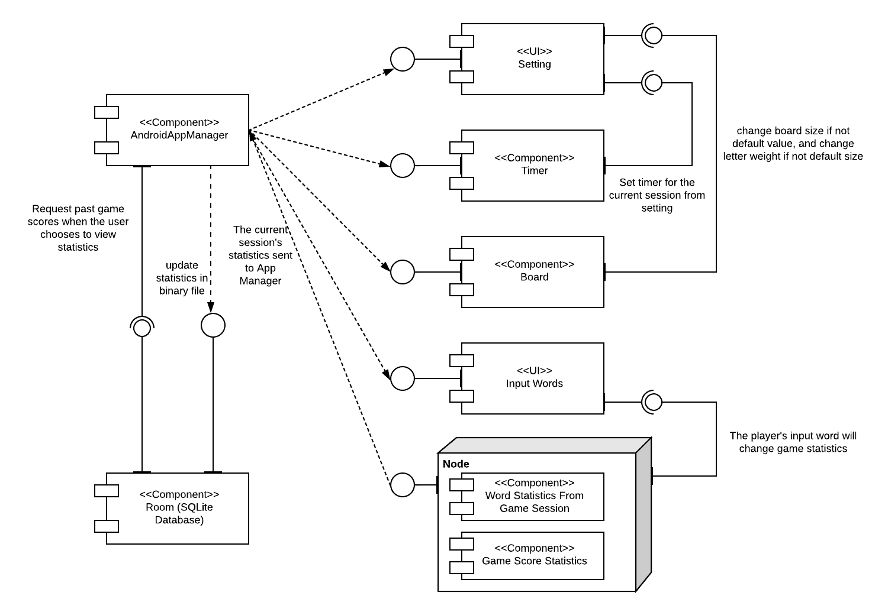
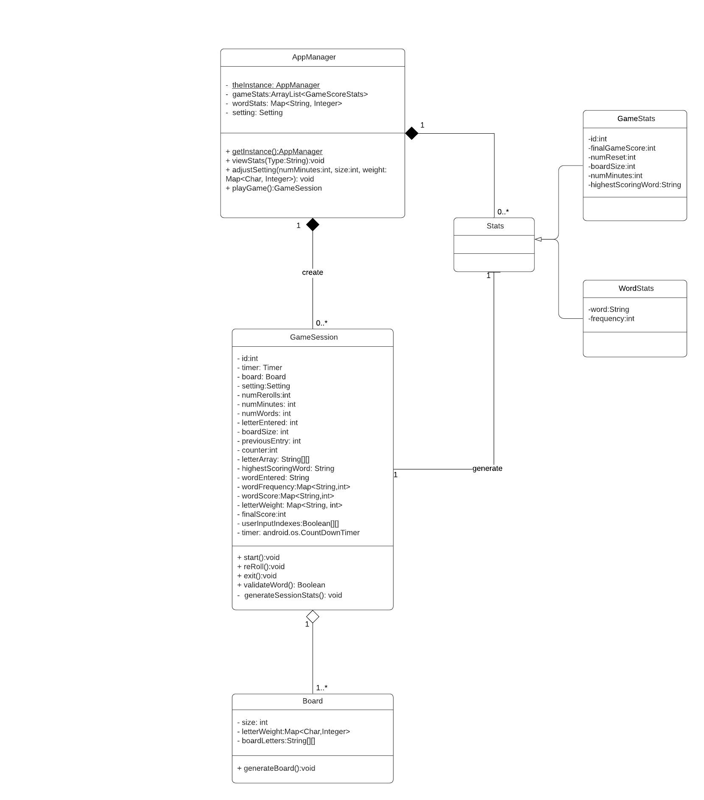
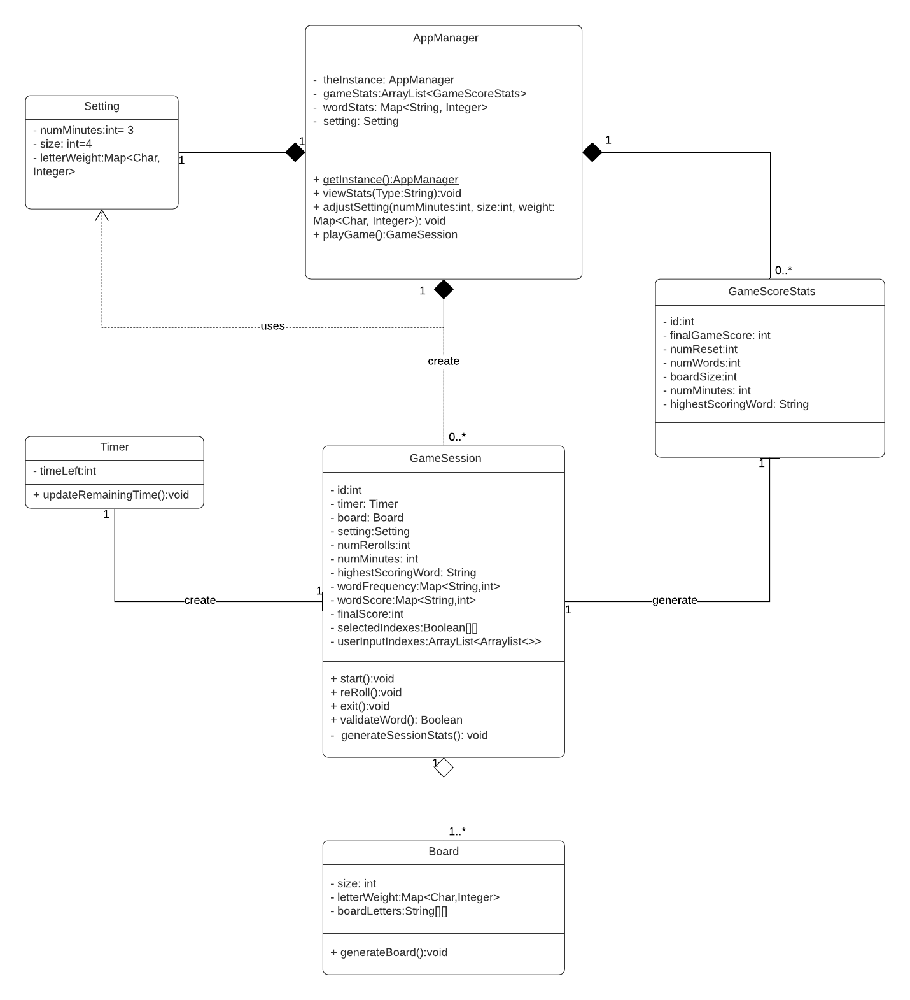
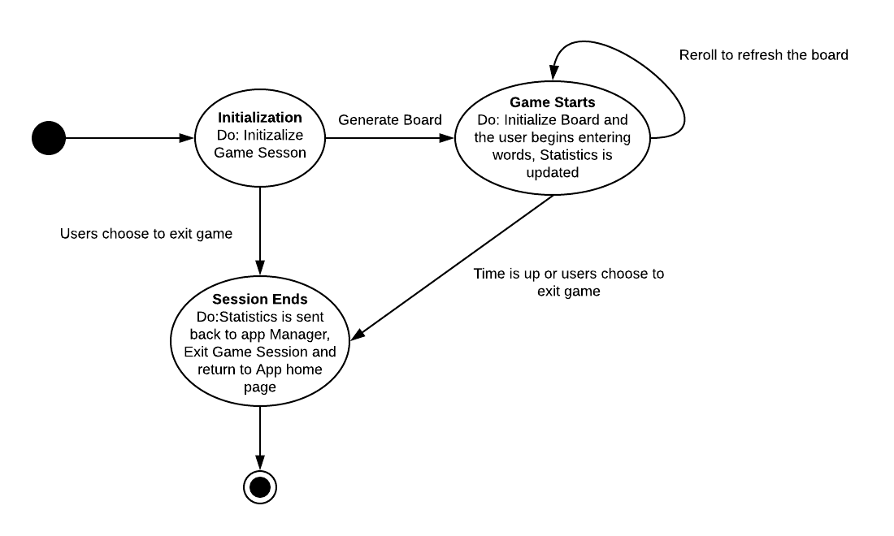
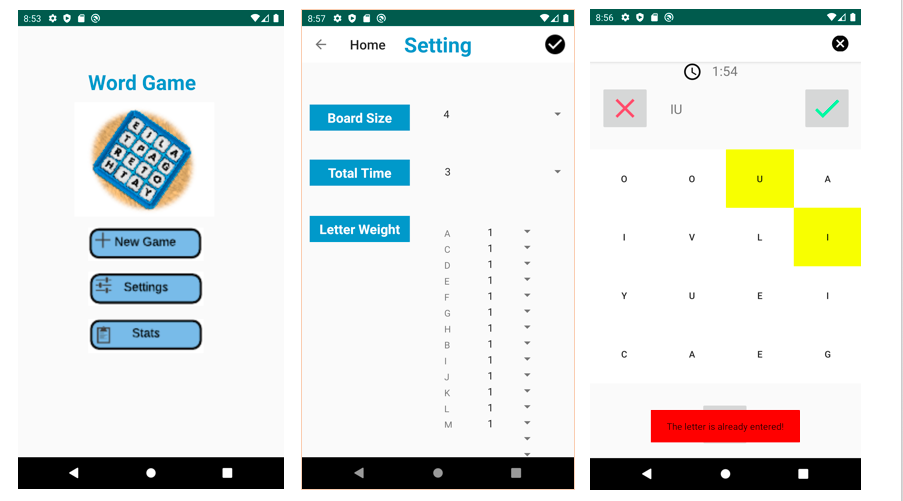
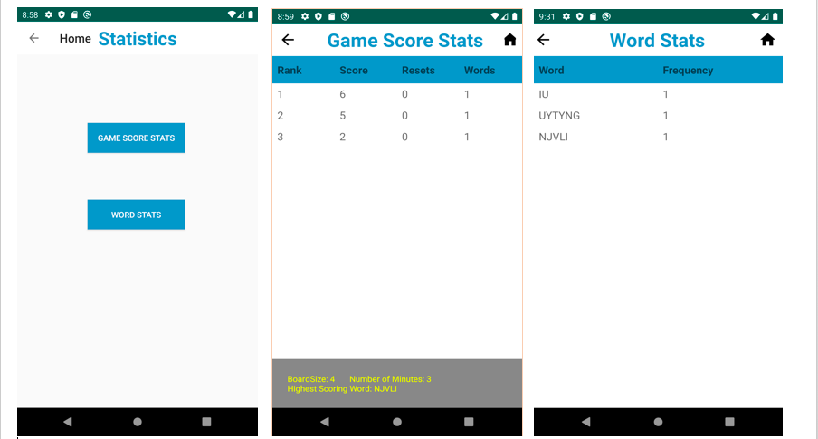

# Design Document

**Author**: Team 59

## 0 Version Control

- This is Version 2 of our documentation deliverables.
- Compared to Version 1 documents, we modified class diagram by adding more attributes in the GameSession class to demonstrate how the components in the GameSession class fulfills system function requirements. We changed sequence chart in the UseCaseModel.md to reflect our final version of interactions among different app activities. We changed our UI design to demonstrate the final representation of our app. We also finalized our user manual to clearly illustrate the functions of each button in the application and how the user plays the game under the specified game rules.

## 1 Design Considerations

### 1.1 Assumptions

- Operation Environment: Android 2.1+
- We assume all the dependencies of the application (like Java Utility Package, Android Studio) are up-to-update. 
- The application is dependent on Room database, which provides an abstraction layer over SQLite, is to persist data locally each time the applicaton exits. 
- If the user switches applications while the game, the application will be running on the backend for a certain time. If idle for too long, the application will be killed.
- We assume the application will be running on phone screen size of 5 inch.

### 1.2 Constraints

- The system relies on Room (SQLite) database to store data for users to reference. However, if the contents saved in the database was removed locally for any reason, the application would lose the file and viewStats function may not work.
- Room (SQLite) may have version conflict with other dependencies.
- The layout of board representation may vary on different smart phone screen size, if the screen size deviates from 5 inch siginificantly, the representation may be distorted.

### 1.3 System Environment

- Hardware: Smart Phone
- Software that the system operates on: Android OS 2.1+
- SDK Version: 29

## 2 Architectural Design

### 2.1 Component Diagram

In this application, we define the computation components that need interface to interact with each other as the following: appManager, Room database, user input words, setting, timer, board, and statistics. Game session is not included because timer, board, and statistics as a whole could represent game session.

The setting and input words are UI components which take user's inputs. The setting would affect timer and board, and input words could affect statistics. For this reason, timer, board, and statistics are represented as required interface. The app manager depends on board, timer, setting, and user inputs to make the game complete. Statistics depends on app manager to get history game statistics to make view stats function complete.

The app manager retrieves data from Room database to display history game statistics so app manager is represented as required interface. At the same time, the data in the Room database also depends on app mananger to get new game statistics updated when a session finishes.

### 2.2 Deployment Diagram

- The deploymnet diagram is unnecessary because all computation components of the application will be running on a single system (a smartphone).

## 3 Low-Level Design

### 3.1 Class Diagram
### Class Diagram V2
There are a few changes we made to the class diagram
- The Setting class is removed. There are only 3 attributes in the original setting class without any methods. Therefore, there is no need to create a seperated class.
- The timer class is removed. Android has the CounterTimeDown class. There is no need to create a seperated one.
- A new class WordStat is added. We original plan to use hashmap for this but a seperated class is more convenient for the ROOM database update. Therefore we add the new class to the design.
- Several small changes are made to gameSession class. Most of them are trivial(like additional int counter). Please refer to the comparison of the class diagram for the details.

### Class Diagram V1

### 3.2 Other Diagrams

- We made a state diagram of GameSession class to demonstrate how this class is initiated and destroyed. When the user chooses to play game in the main menu of the application, a new GameSession will be initialized. The user may exit the session as soon as it is started, in this case, the GameSession class will be destroyed. Also, the user may begin entering the words or rerolling the board initiated. In this process, either runing out of time or user's choosing of exiting could destroy the GameSession class. When the Game Session class is destroyed, the statistics recorded in the session will be sent to app Manager and the main menu will display for user to decide next step.

## 4 User Interface Design

<!--stackedit_data:
eyJoaXN0b3J5IjpbMTYyODQ5NTM1MF19
-->
