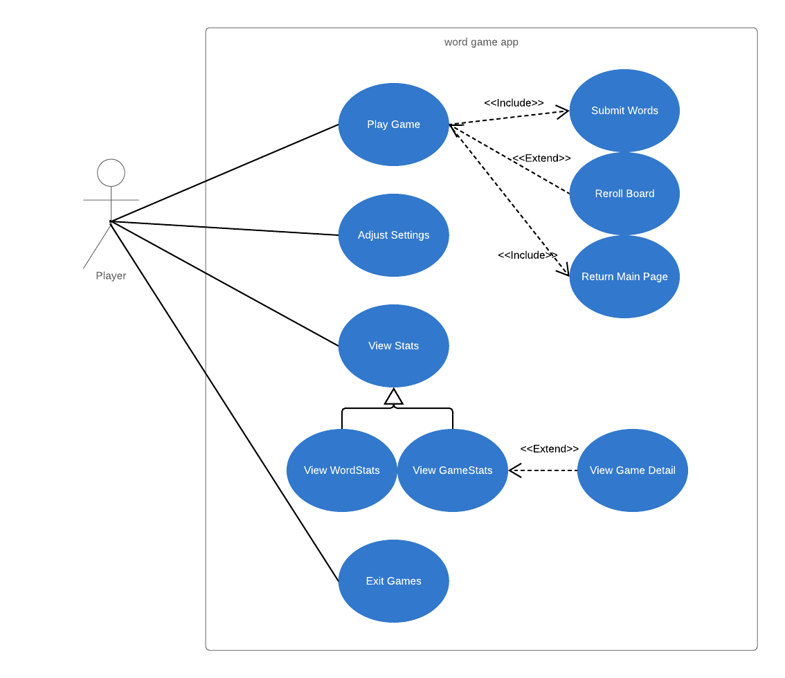
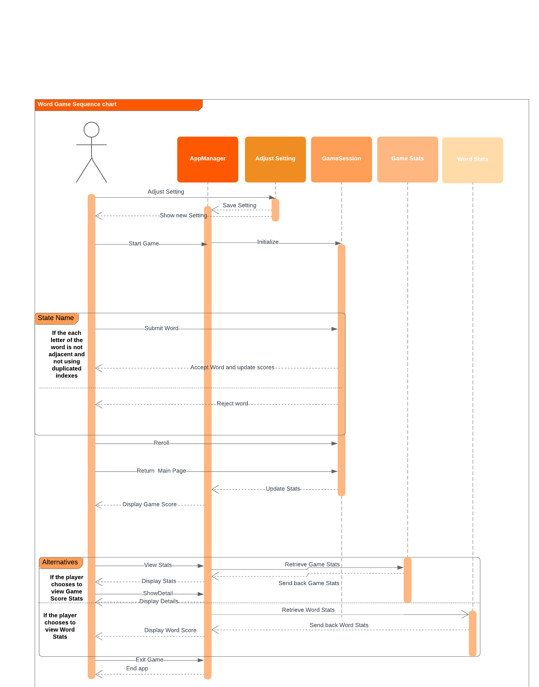
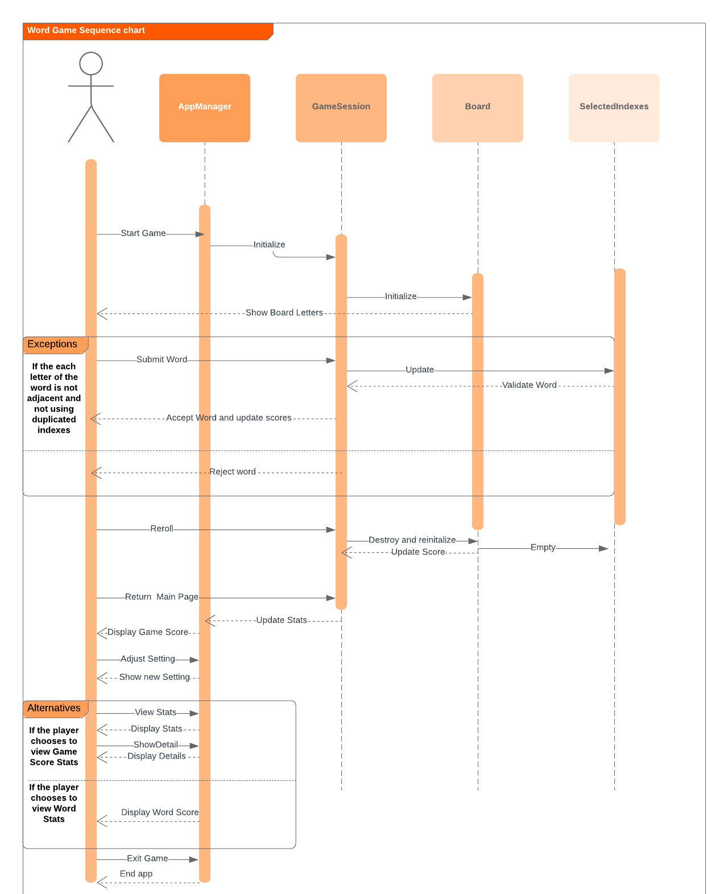

# Use Case Model

**Author**: Team 59

## 1 Use Case Diagram

## 2 Use Case Descriptions

***
### Use Case 1: Play Game
- *Requirements: The player can choose to start a game session at the main game page.*
- *Pre-condition: The player must be in the main game page.*
- *Post-conditions:*
    1. The players are shown the game session GUI page.
    2. A GameSession class is initialized, if the user never change the settings use default value, otherwise use user settings.
    3. The board in the game session is initialized according to the setting and shown to the player.
    4. All score related hashmap will be initalized as null and score attribute is initialized as 0.
- *Scenario:*
    The sequence of events will be shown in the game Sequence chart. There is not alternative/exceptional events in this event.

***
### Use Case 2: Submit Words
- *Requirements: The player can submit words from a board during a game session.*
- *Pre-condition: The player must submit during a game session. The time left should be larger than 0.*
- *Post-condition:*
    1. The selectIndexes attributes must be updated
    2. The word will be validated. Check whether the submitted words are from adjacent letters and don't use duplicated indexes.
    3. If the word is accepted, the wordFrequency, wordScore and score attributes will be updated
- *Scenario:*
    The sequence of events will be shown in the game Sequence chart.

    There is one exceptional event must be caught in this use case. If the submitted word is not accepted (because the indexes are not adjacent or the index are duplicated or the length of the word is less than 2), an error message will be popped up.
    - If the submitted indexes are not adjacent, the error message should be "The letter entered is not connected with previous one!".
    - If the submitted indexes are from duplicated indexes, the error message should be "The letter is already entered!".
    - If the length of th submitted indexes is less than 2, the error message should be "The word length is less than 2.".
	- If the word has been entered before, the error message should be "This word has been entered.".

***
### Use Case 3: Reroll Board
- *Requirements: The player can reroll the current board during a game session.*
- *Pre-condition: The player must reroll during a game session. The time left should be larger than 0.*
- *post-condition:*
    1. The board class will be reinstalled and reinitialized according to the setting
    2. The SelectedIndexes must be empty.
    3. The score and number of rerolls updates must be updates.
- *Scenario:*
    The sequence of events will be shown in the game Sequence chart. There is not alternative/exceptional events in this event.

***
### Use Case 4: Return Main Page
- *Requirement: The player will return to the main page from a game session by click the exit button or when the time is up.*
- *Pre-condition: The player chooses return to main page or the time left equals to 0.*
- *post-condition:*
    1. The gameSession update the GameScoreStats arrayList in the appManager.
    2. The gameSession update the wordStats arrayList in the appManager.
    3. The final score is displayed to the player.
- *Scenario:*
    The sequence of events will be shown in the game Sequence chart. There is not alternative/exceptional events in this event.

***
### Use Case 5: Adjust Setting
- *Requirement: The player will choose adjust the game setting from the adjust Setting page*
- *Pre-condition: The player enters the adjust setting page from the main page and choose the new setting from the adjust setting page.*
- *post-condition:*
    1. The new setting is updated in appManager
    2. Redirect the user to the appManger main page.
- *Scenario:*
    The sequence of events will be shown in the game Sequence chart. There is not alternative/exceptional events in this event.

***
### Use Case 6: View Stats
- *Requirement: The player will choose to view either the GameScoreStats or WordStats*
- *Pre-condition: The player choose the viewStats button from the mainPage.*
- *post-condition:*
    1. Either GamesScoreStats or wordStats will be displayed to users

- *Scenario:*
    The sequence of events will be shown in the game Sequence chart.

    There is an alternative event in this use case.

        1. If GameStats is selected, the final score, the number of resets and the number of words are shown, from highest to lowest. If the player choose any specific game details, that game’s board size, number of minutes, and the highest scoring word will be shown.
        2. If wordStats is selected, the word and number of times that words is played will be shown.

***
### Use Case 7: Exit Game
- *Requirement: The player will exit from the app*
- *Pre-condition: The player can exit the app from the main page.*
- *post-condition: The app will be closed.*
- *Scenario:*
    The sequence of events will be shown in the game Sequence chart. There is not alternative/exceptional events in this event.
### Sequence Chart v2
The main change we made here is remove the board/selectLetter since these are kept in the game Session. AdjustSetting/GameStatsActivity/WordStatsActicity are added to the sequence chart to make the message transition flow more clear.

### Sequence chart v1

<!--stackedit_data:
eyJoaXN0b3J5IjpbLTE4MzQ2MjczNF19
-->
