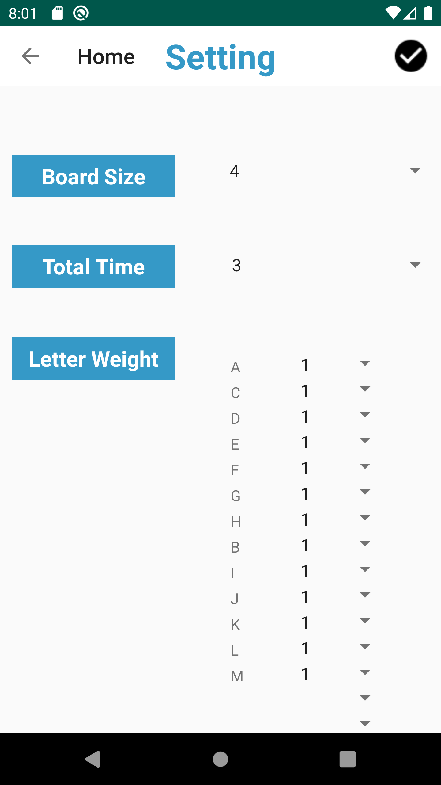
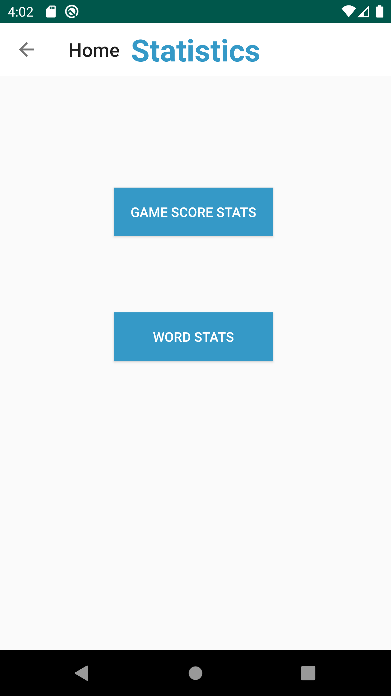

# Design Document

**Author**: Team 59

## 0. Version Control
- This is Version 2 of the user manual.
- Version 2 updates the UI image of the game and the function description of some buttons.

## 1. Main Menu

When the user downloads the app and opens it, the main menu ('home page' and 'main menu' will be used interchangeably in this manual) will be popped up. The user can start a new game by clicking ‘new game’, view and adjust the game settings by clicking ‘settings’, and view the game statistics by clicking the ‘Stats’.

## 2. Settings Page

When the user chooses to adjust the settings in the main menu,the settings page opens up.

The settings include:
- a. Board size: the game will generate a square board, user can choose between 4(x4) and 8(x8), default size is 4x(4).
- b. Total time: the game will be timed, user may choose for the game to end after a certain number of minutes, from 1 to 5. 
Default value is 3 min.
- c. Letter weight: the game board will be filled up with randomly generated letters, based on their weights. User may adjust 
the weights of the letters of the alphabet between 1 and 5, defaulting to 1.

In the top bar, the user may click the back arrow on the top left corner to return back to the main page without saving the current setting, or click the submit button on the right top corner to confirm and save the adjusted setting and go back to the home page.

## 3. Game Page

 

When the user enters the game page, the square board with randomly generated letters is displayed, the settings user chooses are reflected on the board and the timer on the top.

The user may click the cells of the board to enter a unique word,the word has to meet the following requirements:
- a. The word is made up of two or more letters;
- b. the letters must be each adjacent to the next (horizontally, vertically, or diagonally) ;
- c. a single letter may not be used twice.

The entered word will be displayed above the board, user may click the submit (check) button on the right side to submit the entered word, or click the cancel (cross) button on the left side to cancel entering. Each word will score 1 point per letter (‘Qu’ will count as 2 letters)

User may reroll the board at the cost of 5 points by clicking the reroll button under the board.

On the top bar, the user may click the end (cross) button on the right top corner to exit the game before the time is up. When user chooses to early exit the game or the time is up, the score window will be popped up on the screen. User may click any blank area aroud the popped up score window to go back to the main menu.

## 4. Statistics Page

  

The app will jump to the view statistics page after user clicking the ‘Stats’ button in the main menu.

The statistics include:
- a. Game score stats
- b. Word stats

User may click the specific statistics button on the screen to view more details related to the category, if there is any.

In the page of Game Score stats, user may click any row of the ranking to view the specific settings of that game session, such as board size, total time and highest scoring word.

On the top bar, user may click the back arrow on the top left corner to return back to the main page.
